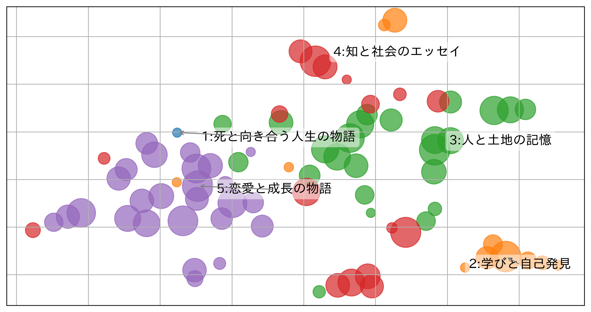

# My読書マップ



読んだ本の「説明文」を文ベクトルに変換し、内容が近い本どうしを集めて、自分の読書傾向を
1枚の地図として描くツールです。点が1冊、色が内容のまとまり（クラスタ）、楕円がその
まとまりの領域を表します。生成AIが本の説明文を読んで、まとまりの名前を付けます。

## 使い方

### 環境

Python 3.10〜3.12 が必要です。3.13以降では `pip install` が失敗します。`.python-version` に
`3.12` を置いているので、pyenv と uv はこのディレクトリで3.12に切り替わります。

### 実行コマンド

プログラムの動作確認のために、以下のコマンドを実行します。初回実行時に文埋め込みモデル
（約500MB）のダウンロードが走ります。

```bash
pip install -r requirements.txt
python main.py data/sample_reading_log.csv
```

`タイトル` と `説明文` の列があるCSVを渡せば、そのまま動きます。設定ファイルはありません。

```bash
python main.py ~/Documents/読書記録.csv
```

クラスタ名の生成にはClaude APIを使います。APIキーを設定しておくと生成AIが命名し、
無ければ頻出語をつないだ名前に自動で代替します。`--no-ai-names` を付けるとAPIを呼ばず、
処理はすべて手元で完結します。

キーはリポジトリ直下の `.env` に書きます。`.env` は `.gitignore` 済みです。

```bash
cp .env.example .env     # ANTHROPIC_API_KEY=sk-ant-... を記入する
```

環境変数 `ANTHROPIC_API_KEY` でも動きます。両方ある場合は環境変数が優先されます。

APIに繋がるかどうかだけを先に確かめられます。接続先と失敗の原因を表示します。

```bash
python -m src.name_clusters
```

### オプション

オプションはすべて省略できます。

| オプション | 既定 | 説明 |
| --- | --- | --- |
| `--k N` | 自動 | クラスタ数を指定する（2以上・冊数-1以下）。省略時はデータから決める |
| `--out DIR` | `outputs` | 出力先ディレクトリ |
| `--no-ai-names` | | 生成AIを使わず、頻出語からクラスタ名を作る（説明文を外部に送らない） |
| `--model` | `claude-opus-5` | 命名に使うモデル |
| `--perplexity N` | 自動 | t-SNEのperplexity。省略すると冊数から決める |
| `--embed-model` | MiniLM | 文埋め込みモデルを差し替える |
| `--force-embed` | | キャッシュを無視してベクトル化をやり直す |

### 出力されるファイル

出力されるもの（`outputs/`）。ファイル名には実行時刻が入るので、同じ出力先に何度実行しても
前回の結果は上書きされません（例: `reading_map_20260921-104300.png`）。キャッシュの2ファイル
だけは時刻が付かず、実行のたびに使い回します。

| ファイル | 中身 |
| --- | --- |
| `reading_map_<時刻>.png` | 全体マップ。クラスタを色分けし、散らばりを楕円で示す |
| `cluster_0_<時刻>.png` … | クラスタ別マップ。1つだけ色を付け、中心的な本のタイトルを表示 |
| `cluster_summary_<時刻>.csv` | クラスタ名・冊数・代表本・頻出語の一覧 |
| `clustered_books_<時刻>.csv` | クラスタIDとt-SNE座標を付けた全データ |
| `clustered_books_public_<時刻>.csv` | 上記から説明文を除いたもの（結果を共有するとき用） |
| `k_selection_<時刻>.png` / `.csv` | クラスタ数の検討に使った指標。`--k` を指定したときは作りません |
| `similar_pairs_<時刻>.csv` | 説明文の類似度が0.5を超える本のペア |
| `embeddings.npy` | ベクトルのキャッシュ |
| `embeddings.json` | キャッシュのメタ情報。モデル名・次元数・件数・説明文のハッシュ |

## ディレクトリ構成

```text
├── main.py                  実行の入口（python main.py <CSV>）
├── src/
│   ├── embed.py             CSVの読み込みと説明文のベクトル化
│   ├── cluster.py           クラスタ数の決定とKMeans
│   ├── label.py             頻出語の抽出（Janome + TF-IDF）
│   ├── name_clusters.py     クラスタ名の生成（Claude API）
│   ├── visualize.py         t-SNEと各種マップの描画
│   └── plot_style.py        日本語フォントの設定
├── data/
│   ├── sample_reading_log.csv   パブリックドメイン作品20冊のサンプル
│   └── README.md                CSVの仕様
├── tests/                   pytestのテスト（APIと埋め込みモデルは呼ばない）
├── requirements.txt         main.py の実行に必要なすべて
├── requirements-core.txt    埋め込みモデル以外の依存
├── requirements-dev.txt     テストとlintに必要な依存
├── pyproject.toml           ruffとpytestの設定
└── docs/                    READMEのトップに貼る図
```

## 作成フロー

ステップごとに使うプログラム・手法・目的は次のとおりです。

| ステップ | プログラム | 手法 | 目的 |
| --- | --- | --- | --- |
| 1. 読み込み | `src/embed.py` | pandasでCSVを読み、必須列を検査する | 説明文を処理できる形にそろえる |
| 2. ベクトル化 | `src/embed.py` | Sentence-BERTで384次元に変換し、L2正規化する | 説明文の内容どうしを数値で比べられるようにする |
| 3. クラスタ数の決定 | `src/cluster.py` | エルボー法（inertia）、冊数から決まる上限、クラスタの最低冊数 | 冊数に合ったまとまりの数を決める |
| 4. クラスタリング | `src/cluster.py` | KMeans（384次元空間、乱数固定） | 内容が近い本を同じグループにする |
| 5. クラスタ名の生成 | `src/label.py`／`src/name_clusters.py` | Janome＋TF-IDFで頻出語、Claude APIで命名 | 図に載せる見出しを作る |
| 6. 2次元化と描画 | `src/visualize.py`／`src/plot_style.py` | t-SNE（コサイン）、matplotlib、adjustText | 地図として1枚の画像にする |

グループ分けはステップ4までに384次元空間で完了します。ステップ6は、その結果を
人が見て分かる形にするための描画です。

### その他の仕様

- **入力**　3冊以上、かつ内容の異なる説明文が2件以上必要です。満たさなければその場で
  止まります。説明文の欠損は空文字として扱い、件数を表示して処理を続けます。

- **埋め込みモデル**　既定は `sentence-transformers/paraphrase-multilingual-MiniLM-L12-v2`
  です。

- **キャッシュの再利用**　冊数・埋め込みモデル・説明文の内容が前回とすべて一致するときだけ
  `embeddings.npy` を再利用します。一致しない項目があれば、その理由を表示して作り直します。

- **クラスタ数k**　kを2から14まで（冊数が少ないときは `冊数 - 1` まで）変えて試します。
  エルボーは、inertiaの曲線と両端を結ぶ直線との距離が最大になるkです。この値を軸に、
  `冊数 ÷ 4`（小数点以下切り捨て）と14の小さいほうを上限、2を下限とします。さらに、
  最小クラスタが2冊を下回るあいだkを1つずつ下げます。`--k` を指定したときは、この手順を
  通りません。

- **シルエット係数**　コサイン距離で計算し、試した各kと採用したkについて表示します。
  kの決定には使いません。0.25を下回る場合は、クラスタが明確に分離していない旨をあわせて
  表示します。

- **KMeans**　384次元の空間で計算します。距離はユークリッド距離、初期値の選び方は
  `n_init="auto"`、乱数は固定です。

- **頻出語**　Janomeで名詞・動詞・形容詞の原形だけを取り出します（非自立・接尾・代名詞・
  数は落とします）。1クラスタの説明文をつないだものを1文書とし、全クラスタを1つの
  コーパスとしてTF-IDFを学習します。

- **APIに送るデータ**　クラスタごとに、重心に近い順で最大8冊分のタイトルと説明文
  （先頭300文字）・頻出語・冊数を送ります。返り値はPydanticのモデルで構造化出力として
  受け取ります。`--no-ai-names` のときは送りません。

- **t-SNE**　perplexityは冊数から決めます（`min(30, (冊数 - 1) // 3)`、下限5）。

- **楕円**　クラスタの領域の目安で、統計的な信頼区間ではありません。2冊以上のクラスタに
  描き、2冊のクラスタや直線状に並んだクラスタでは、短軸を長軸の0.35倍まで確保します。

- **再現性**　t-SNEの乱数は固定しています。同じCSVを同じ設定で実行すれば、座標は前回と
  一致します。説明文や冊数が変わると座標は変わります。クラスタ名は実行のたびに生成AIが
  作るので、同じCSVでも文言は変わります（`--no-ai-names` のときは頻出語から作るので
  変わりません）。

## ライセンス

コードは MIT License（[LICENSE](LICENSE)）です。

`data/sample_reading_log.csv` の説明文は、パブリックドメイン作品について本リポジトリの
著者が書き下ろしたものです。
