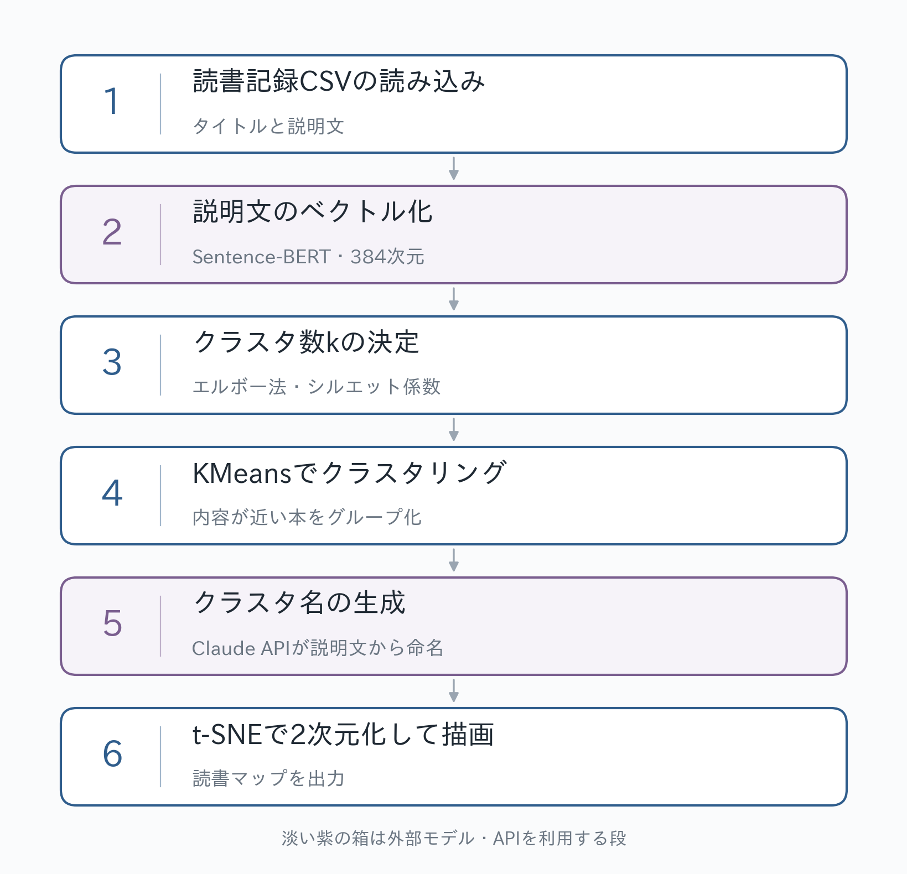

# My読書マップ


読んだ本の「説明文」を文ベクトルに変換し、内容が近い本どうしを集めて、自分の読書傾向を
1枚の地図として描くツールです。点が1冊、色が内容のまとまり（クラスタ）、楕円がその
まとまりの領域を表します。生成AIが本の説明文を読んで、まとまりの名前を付けます。

## 使い方と環境

```bash
pip install -r requirements.txt
python main.py data/sample_reading_log.csv
```

`タイトル` と `説明文` の列があるCSVを渡せば、そのまま動きます。設定ファイルはありません。

```bash
python main.py ~/Documents/読書記録.csv
```

クラスタ名の生成にはClaude APIを使います。APIキーを設定しておくと生成AIが命名し、
無ければ頻出語をつないだ名前で代替します（処理は止まりません）。

キーはリポジトリ直下の `.env` に書きます。`.env` は `.gitignore` 済みです。

```bash
cp .env.example .env     # ANTHROPIC_API_KEY=sk-ant-... を記入する
```

環境変数 `ANTHROPIC_API_KEY` でも動きます。両方ある場合は環境変数が優先されます。

APIに繋がるかどうかだけを先に確かめられます。接続先と失敗の原因を表示します。

```bash
python -m src.name_clusters
```

オプションはすべて省略できます。

| オプション | 既定 | 説明 |
| --- | --- | --- |
| `--k N` | 自動 | クラスタ数を指定する。省略時はデータから決める |
| `--out DIR` | `outputs` | 出力先ディレクトリ |
| `--no-ai-names` | | 生成AIを使わず、頻出語からクラスタ名を作る |
| `--model` | `claude-opus-5` | 命名に使うモデル |
| `--perplexity N` | 自動 | t-SNEのperplexity。省略すると冊数から決める |
| `--embed-model` | MiniLM | 文埋め込みモデルを差し替える |
| `--force-embed` | | ベクトル化をやり直す（説明文を書き換えたとき） |

出力されるもの（`outputs/`）:

| ファイル | 中身 |
| --- | --- |
| `reading_map.png` | 全体マップ。クラスタを色分けし、散らばりを楕円で示す |
| `cluster_0.png` … | クラスタ別マップ。1つだけ色を付け、中心的な本のタイトルを表示 |
| `cluster_summary.csv` | クラスタ名・冊数・まとまりの良さ・代表本・頻出語の一覧 |
| `clustered_books.csv` | クラスタIDとt-SNE座標を付けた全データ |
| `clustered_books_public.csv` | 上記から説明文を除いたもの（結果を共有するとき用） |
| `k_selection.png` / `.csv` | クラスタ数の検討に使った指標。`--k` を指定したときは作りません |
| `similar_pairs.csv` | 説明文の類似度が0.5以上の本のペア |
| `embeddings.npy` | ベクトルのキャッシュ。冊数が変われば自動で作り直す |

動作環境は Python 3.12.2（macOS）で確認しています。初回実行時に文埋め込みモデル
（約500MB）のダウンロードが走ります。

## ディレクトリ構成

```
├── main.py                  実行の入口（python main.py <CSV>）
├── src/
│   ├── embed.py             CSVの読み込みと説明文のベクトル化
│   ├── cluster.py           クラスタ数の決定とKMeans
│   ├── label.py             頻出語の抽出（Janome + TF-IDF）
│   ├── name_clusters.py     クラスタ名の生成（Claude API）
│   ├── visualize.py         t-SNEと各種マップの描画
│   └── plot_style.py        日本語フォントの設定
├── data/
│   ├── sample_reading_log.csv   パブリックドメイン作品20冊のサンプル
│   └── README.md                CSVの仕様
├── docs/                    READMEに使う図と、フロー図の生成スクリプト
└── experiments/
    └── dash_app.py          クリックで詳細を見るDashアプリ（試作）
```

Dashアプリは、パイプラインを実行したあとに使います。

```bash
pip install -r requirements-experiments.txt
python experiments/dash_app.py --out outputs
```

## 作成フロー



読書記録のCSVを読み込み、説明文を文ベクトルに変換して、似ているものどうしをまとめます。
まとめる数（クラスタ数）は指標を計算して決め、できたグループには生成AIが見出しを付けます。
最後に、ベクトルを2次元に落として地図として描きます。

### 1. 読書記録CSVの読み込み

必要な列は `タイトル` と `説明文` の2つで、3冊以上必要です。条件を満たさなければその場で
止まります。説明文の欠損は空文字として扱い、件数を表示して処理を続けます。
ベクトル化の対象は説明文だけで、タイトルや著者は図のラベルに使います。

### 2. 説明文のベクトル化

Sentence-BERT（`sentence-transformers/paraphrase-multilingual-MiniLM-L12-v2`）で、
説明文1件を384次元のベクトルに変換します。多言語で学習されたモデルで、語が一致して
いなくても内容が近ければ近いベクトルになります。本どうしの近さはコサイン類似度で測ります。

ベクトルは長さ1に正規化します。KMeansの距離もt-SNEの距離もコサイン基準になります。

ベクトルは `outputs/embeddings.npy` にキャッシュして次回は再利用し、冊数が変わった場合は
作り直します。

### 3. クラスタ数kの決定

kは固定していません。実行するたびにデータから計算します。kを2から順に変えて
クラスタリングし、2つの指標を計算します。

- **エルボー法**：クラスタ内誤差（inertia）の下がり方が鈍くなる点
- **シルエット係数**：クラスタがどれだけ分離しているか

エルボー法の値を軸に選び、1クラスタが5冊を下回らないよう、冊数から決まる上限で頭を
押さえます。選んだ値と対立する候補は両方表示し、`--k` で上書きできます。

### 4. KMeansでクラスタリング

決まったkでKMeansを実行し、各本にクラスタIDを割り当てます。初期値の選び方は
`n_init="auto"`、乱数は固定です（同じ入力なら同じ結果になります）。

割り当て後、クラスタごとにメンバー同士の平均コサイン類似度を計算し、まとまりの良さを
`cluster_summary.csv` に出力します。

### 5. クラスタ名の生成

Janomeで説明文を形態素解析し、名詞・動詞・形容詞の原形だけを取り出して、TF-IDFで
クラスタごとの頻出語を出します。

次に、クラスタの重心に近い本8冊の説明文と頻出語をClaude API（`claude-opus-5`）に渡し、
共通するテーマを表す短い見出しを作らせます。返り値はPydanticのモデルで構造化出力として
受け取り、クラスタIDと見出しを対応付けます。APIキーが無い場合やAPIに繋がらない場合は、
頻出語をつないだ名前にフォールバックします。

### 6. t-SNEで2次元化して描画

t-SNEで384次元のベクトルを2次元に落とします。近いものを近くに配置する手法で、軸に
意味はありません。点の間の距離と、かたまりの分かれ方を見る図です。

距離はコサインを使います。perplexityは冊数から決めます（`min(30, (冊数 - 1) // 3)`、
下限5）。`--perplexity` で指定もできます。

描くのは2種類です。全体マップ（クラスタごとに色と楕円、名前は重なりを自動回避して配置）と、
クラスタ別マップ（1つだけ色を付け、重心に近い本を大きく描き、中心的な本のタイトルを表示）。

全体マップの楕円は、クラスタの点から標準偏差1.65倍の範囲を描いたものです。8冊以上の
クラスタでは、重心に近い85%の点だけを使います。共分散には円に近づける補正を
`min(0.5, 4 / 冊数)` の重みで加えます。半径はそのクラスタの点の広がりが上限です。
2冊以下のクラスタには楕円を描きません。クラスタの核となる領域を示すので、そこから
離れた点は自分の楕円の外に出ます。

t-SNEの座標は再計算すると配置が変わります。クラスタ名ラベルの位置も、同じ座標から
描き直すたびに変わります（重なりの自動回避が毎回やり直されるため）。同じ図を使い続ける
場合は、生成された画像と `clustered_books.csv` の座標を保存してください。どの本が同じ
クラスタに入るかは、再実行しても変わりません。

## ライセンス

コードは MIT License（[LICENSE](LICENSE)）です。

`data/sample_reading_log.csv` の説明文は、パブリックドメイン作品について本リポジトリの
著者が書き下ろしたものです。著者自身の読書記録はこのリポジトリに含めていません。
